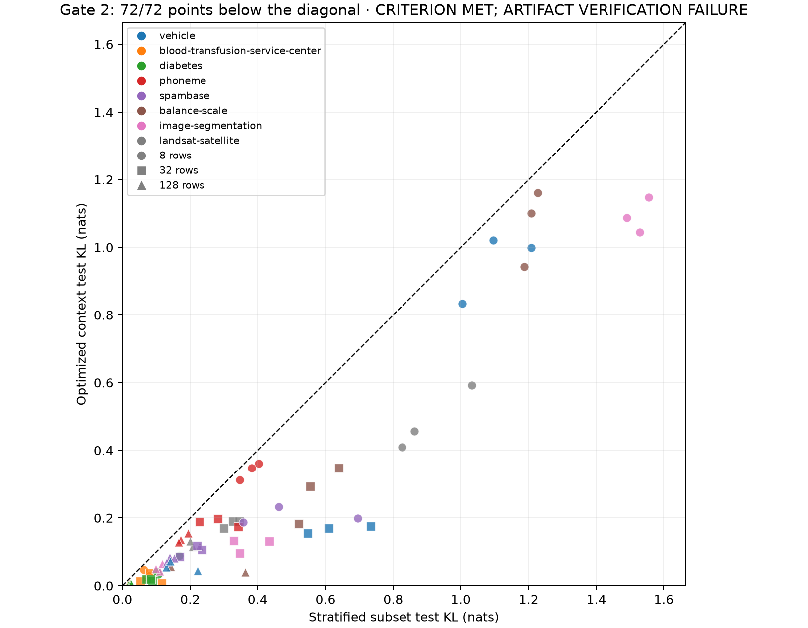

# Gate 2 — cross-dataset replication

## Verdict: CRITERION MET; ARTIFACT VERIFICATION FAILURE

72/72 runs (100.0%) improved test teacher KL; 8/8 datasets have positive mean absolute improvement. Median absolute improvement is 0.081216 nats. The statistical criterion is met. Artifact reload verification: 63/72.

The preregistered PASS rule is at least 58/72 strict test-KL wins, positive mean improvement on at least 6/8 datasets, and positive median absolute improvement. All runs must finish and all artifacts must verify. No datasets were excluded.

Vehicle was known before Gate 2. The seven new datasets are the prospective replication panel; their results are also recorded separately in `gate-decision.json`.

| Dataset | N context | d | K | Wins / 9 | Mean subset KL | Mean optimized KL | Mean ΔKL |
|---|---:|---:|---:|---:|---:|---:|---:|
| vehicle | 507 | 18 | 4 | 9 | 0.632044 | 0.391710 | 0.240335 |
| blood-transfusion-service-center | 448 | 4 | 2 | 9 | 0.057654 | 0.019435 | 0.038218 |
| diabetes | 460 | 8 | 2 | 9 | 0.076289 | 0.026010 | 0.050279 |
| phoneme | 3242 | 5 | 2 | 9 | 0.280135 | 0.222169 | 0.057965 |
| spambase | 2760 | 57 | 2 | 9 | 0.284754 | 0.129340 | 0.155415 |
| balance-scale | 375 | 4 | 3 | 9 | 0.658814 | 0.461604 | 0.197210 |
| image-segmentation | 1386 | 19 | 7 | 9 | 0.667770 | 0.421840 | 0.245930 |
| landsat-satellite | 3861 | 36 | 6 | 9 | 0.480957 | 0.263557 | 0.217400 |

## Context-size regimes

| Context rows | Wins / 24 | Mean ΔKL | Median ΔKL |
|---:|---:|---:|---:|
| 8 | 24 | 0.198054 | 0.137819 |
| 32 | 24 | 0.185286 | 0.133562 |
| 128 | 24 | 0.067692 | 0.055347 |

## Runs without test-fidelity improvement

| Dataset | m | Seed | ΔKL | Compile KL before → after | G_test after | Selected step |
|---|---:|---:|---:|---:|---:|---:|
| None | — | — | — | — | — | — |

0 runs improved compile KL but worsened test KL. 3 initial contexts omitted at least one class. Total new optimization time (excluding teacher, evaluation and reload): 1370.9 seconds.

## Frozen protocol

- Exact Gate 1 checkpoint and TabPFN commit; fixed labels; numerical inputs; one estimator; float32; unchanged preprocessing, split procedure, optimizer, KL objective, query batching, and metrics.
- Budgets 8/32/128, seeds 42/43/44, stratified initialization, Adam LR 0.01, exactly 50 steps. As in Gate 1, retain minimum compile KL among steps 0/10/20/30/40/50. Validation and test never select iterates.
- Five existing corpus datasets and three numerical UCI tasks. No imputation, feature selection, row filtering, or dataset-specific tuning. The original UCI training and test partitions are concatenated before applying the common deterministic 60/20/10/10 split.
- Balanced means max/min class frequency ≤1.5; material imbalance means ≥2. The panel meets all eight coverage requirements; see `preregistration.json`.

## Failure modes and practical limits

- Negative and zero ΔKL remain in the analysis. `paired-metrics.csv` records before/after compile, validation and test KL, accuracy/AUC/log-loss, generalization gaps, class distributions, dimensions, selected steps, runtime and artifact paths.
- One fixed split per dataset and three seeds do not provide 72 independent dataset-level observations. Class proportions, scale, and inductive biases differ across tasks; this is an empirical replication gate, not a proof or a context-complexity estimate.
- Published datasets can contain duplicate or correlated examples. We preserve Gate 1’s row-wise split and do not claim group-disjoint or out-of-domain generalization. Numerical zero values are retained, including the conventional zero-coded missing measurements in Diabetes.
- Vehicle reuses nine original stratified runs. Original prediction arrays were not retained in Gate 1, so reference arrays were reconstructed from exported CSVs and checked against original KL before a second fresh-model reload. New runs compare directly to prediction arrays saved during evaluation. The numerical tolerance remains 1e-5.
- Landsat exceeded the 8.29 GB MPS allocation during teacher inference, including a retry with the allocator high-watermark setting disabled. Its identical model/data/optimization protocol ran on CPU. This is a preregistration device deviation and both OOM attempts are preserved. Landsat optimized CSV reload status is reported against the same 1e-5 KL threshold.
- Runtime and inference latency describe this Apple GPU and the unchanged uncached differentiable inference path. Peak RSS is cumulative process memory, not per-context GPU memory.

- Native TabPFN automatic memory recovery occurred in ['spambase-run.log']. These are internal row/column chunk reductions by the unchanged model code, not manually changed hyperparameters or dataset filtering. Exact messages are saved in `native-memory-recovery.json` and the original logs.

## Data sources

Additional UCI datasets: [Balance Scale](https://archive.ics.uci.edu/dataset/12/balance+scale), [Image Segmentation](https://archive.ics.uci.edu/dataset/50/image+segmentation), [Statlog Landsat Satellite](https://archive.ics.uci.edu/dataset/146/statlog+landsat+satellite). Raw download URLs and SHA-256 hashes are in the preregistration. Existing datasets retain their local corpus profiles.

## Reproduction

The preregistration contains dataset/checkpoint/code hashes and all frozen settings. Per-dataset folders contain metadata with split indices and scaling, cached teacher probabilities, baseline/optimized predictions, CSV contexts, optimization traces, and reload verification. `execution-status.json` and logs retain all execution failures.

Run or resume the complete frozen pipeline with `scripts/gate2.py`. It validates hashes and the TabPFN commit, skips complete datasets, fills missing experiments and verification records, preserves failed attempts, and invokes this aggregator. Use `scripts/gate2.py --dry-run` to inspect planned work without changing artifacts.
