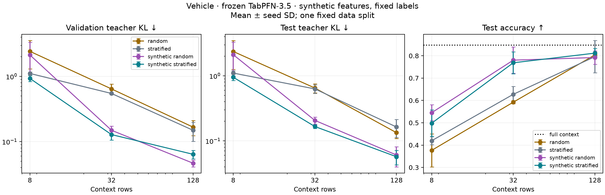

# TabPFN Compile: first feasibility experiment

This is the fixed-budget gate from the handover, using synthetic features and fixed integer labels.

Feature optimization beats its matched real-row baseline on both validation and test KL in 18/18 runs. This supports the central phenomenon on this dataset, especially at 32 and 128 rows. It does not yet establish generality across datasets.

No high-fidelity claim at KL ≤ 0.01: the best validation KL among these runs is 0.0420. Compile KL below 0.01 at 128 rows does not carry over to held-out queries.

## Setup

- Dataset: Vehicle, 846 rows, 18 numerical features, four classes.
- Disjoint stratified split: 507 teacher-context / 169 compile / 85 validation / 85 test rows.
- Standardization fitted only on teacher-context rows; features clamped to its min/max ±1 standardized unit.
- Budgets: [8, 32, 128]; seeds: [42, 43, 44]; 50 Adam steps, learning rate 0.01, query batches of 64.
- Each synthetic run starts from the exact matched random or stratified subset. Lowest compile KL selects the saved iterate, including the initial context. Neither validation nor test selects an iterate, seed, or budget.
- Teacher, baselines and synthetic contexts use one estimator, float32, and the same native differentiable preprocessing path. This is not the default multi-estimator, preprocessed TabPFN API predictor.
- Model parameters frozen; nonzero finite feature gradients verified; no model weight gradients accumulated.

## Held-out results

Means over three initialization/optimization seeds on the same data split. KL is teacher-to-student divergence in nats; lower is better.

| Rows | Method | Validation KL | Test KL | Test accuracy | Test AUC | Test log-loss | Latency (ms) |
|---:|---|---:|---:|---:|---:|---:|---:|
| 8 | random | 2.4237 | 2.3673 | 0.376 | 0.736 | 2.639 | 91.3 |
| 8 | stratified | 1.1101 | 1.1024 | 0.420 | 0.675 | 1.359 | 105.9 |
| 8 | synthetic_random | 2.1318 | 2.1137 | 0.545 | 0.784 | 2.390 | 103.7 |
| 8 | synthetic_stratified | 0.9313 | 0.9515 | 0.498 | 0.768 | 1.217 | 103.3 |
| 32 | random | 0.6430 | 0.6497 | 0.592 | 0.860 | 0.917 | 100.0 |
| 32 | stratified | 0.5478 | 0.6301 | 0.627 | 0.848 | 0.942 | 120.8 |
| 32 | synthetic_random | 0.1494 | 0.2068 | 0.780 | 0.933 | 0.501 | 104.1 |
| 32 | synthetic_stratified | 0.1283 | 0.1665 | 0.769 | 0.938 | 0.461 | 101.8 |
| 128 | random | 0.1668 | 0.1339 | 0.804 | 0.943 | 0.382 | 134.7 |
| 128 | stratified | 0.1493 | 0.1637 | 0.796 | 0.943 | 0.406 | 155.7 |
| 128 | synthetic_random | 0.0467 | 0.0608 | 0.792 | 0.946 | 0.400 | 140.3 |
| 128 | synthetic_stratified | 0.0640 | 0.0572 | 0.812 | 0.958 | 0.370 | 137.4 |
| 507 | full | 0.0000 | 0.0000 | 0.847 | 0.956 | 0.351 | 369.4 |

## Matched comparisons

- 8 rows, random initialization: test KL reduced 10.7%; wins 3/3 test, 3/3 validation; 63.38× fewer context rows; 3.56× measured inference speedup.
- 32 rows, random initialization: test KL reduced 68.2%; wins 3/3 test, 3/3 validation; 15.84× fewer context rows; 3.55× measured inference speedup.
- 128 rows, random initialization: test KL reduced 54.6%; wins 3/3 test, 3/3 validation; 3.96× fewer context rows; 2.63× measured inference speedup.
- 8 rows, stratified initialization: test KL reduced 13.7%; wins 3/3 test, 3/3 validation; 63.38× fewer context rows; 3.58× measured inference speedup.
- 32 rows, stratified initialization: test KL reduced 73.6%; wins 3/3 test, 3/3 validation; 15.84× fewer context rows; 3.63× measured inference speedup.
- 128 rows, stratified initialization: test KL reduced 65.1%; wins 3/3 test, 3/3 validation; 3.96× fewer context rows; 2.69× measured inference speedup.



## Interpretation limits

- Three seeds measure initialization/optimization variability, not uncertainty across data splits or datasets. The 85-row test set is small; evidence here cannot establish consistent gains across tasks.
- These are empirical fixed-budget results, not a global optimum or a discovered minimum context size. No automatic size search or tolerance claim is made.
- The native 3.5 architecture casts targets to integer indices in its class embeddings and one-hot decoder. The diagnostic yielded a nonzero feature gradient and no label gradient. Fixed labels were explicitly approved for this gate; no soft-label model modification was made.
- Timing is median of three warm fit-plus-forward calls over the same 85 test queries, split into batches of 64, including synchronization and copying predictions to CPU. It excludes checkpoint loading and optimization. It is specific to this uncached differentiable path and Apple GPU.
- `process_peak_rss_bytes` is cumulative CPU process high-water memory, not per-context GPU memory; it does not establish a memory benefit.
- Compression denominator is 507 teacher-context rows, not all 846 source rows.

- At eight rows, random seeds 43 and 44 each omit a class. Fixed-label feature optimization cannot restore that class, explaining much of the high divergence. Stratified subsets cover all four classes.
- Better teacher fidelity does not guarantee better ground-truth accuracy: the 128-row random runs improve KL while mean test accuracy changes from 80.4% to 79.2%.

## Artifacts and reproduction

`metadata.json` records source/checkpoint hashes, source commit, software versions, split indices, feature order, standardization and class encoding. `teacher.npz` caches teacher probabilities. `results.json`/`metrics.csv` contain all held-out metrics; `traces.json` contains compile-only optimization history.

Each `compiled-<rows>-<seed>-<initialization>.csv` contains standardized features and fixed encoded labels. Reload those tensors with `n_classes_=4`, `differentiable_input=True`, and `fit_with_differentiable_input`; standardize new queries with metadata mean/scale. Do not standardize the compiled rows twice or decode labels into strings. The artifact is specific to this checkpoint and inference configuration.

From the repository root (choose a new output directory):

```bash
PYTHONPATH=../TabPFN/src MPLCONFIGDIR=/tmp/tabpfn-compile-mpl \
  .venv/bin/python -u scripts/tabpfn_compile_experiment.py \
  --device mps --label-mode fixed \
  --output artifacts/vehicle-reproduction
.venv/bin/python scripts/summarize_tabpfn_compile.py \
  artifacts/vehicle-reproduction
```

## Reload verification

All 18 CSV artifacts were reloaded in fresh model instances. Compile/validation/test KL reproduced within 1.9e-06 absolute error (acceptance threshold 1e-5). See `artifact-verification.json`.
